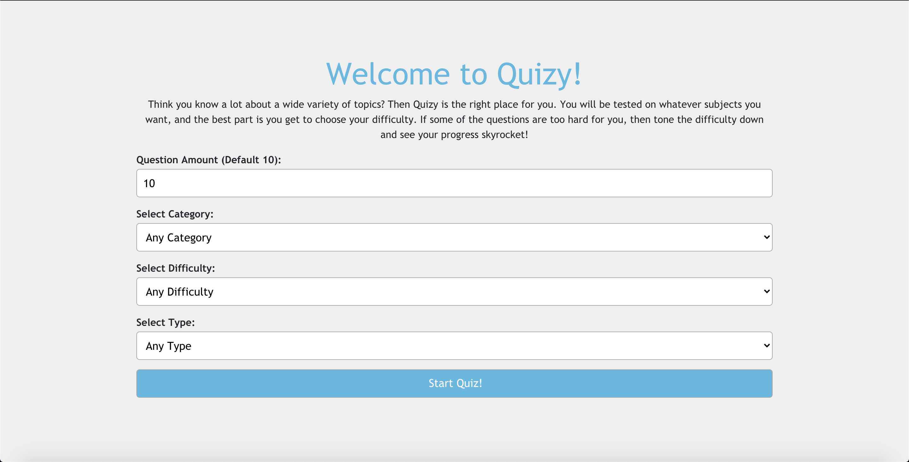

<br />
<p align="center">
    <a href="#">
        
    </a>
    <h2 align="center">Movie Max</h3>
    <p align="center">
        Think you know a lot about a wide variety of topics? Then Quizy is the right place for you. You will be tested on whatever subjects you want, and the best part is you get to choose your difficulty. If some of the questions are too hard for you, then tone the difficulty down and see your progress skyrocket!
        <br />
        <br />
        <a href="quizy.lgarcia.us">View Demo</a>
        ·
        <a href="https://github.com/luisg5/quizy-frontend/issues">Report Bug</a>
        ·
        <a href="https://github.com/luisg5/quizy-frontend/issues">Request Feature</a>
    </p>
</p>

### Table of Contents

- [About the Project](#about-the-project)
  - [Built Using](#built-using)
- [Getting Started](#getting-started)
  - [Installation](#installation)
- [Contributing](#contributing)
- [License](#license)
- [Contact](#contact)
- [Acknowldegements](#acknowldegements)

## About the Project



This single-page application uses the Open Trivia DB API to generate a custom quiz, based on your own criteria. You can choose the quiz category, difficulty, and even the number of questions you would like to be tested on!

### Built Using

- [The Open Trivia DB (API)](https://opentdb.com/)
- [React](https://reactjs.org)
  - [React Bootstrap](https://react-bootstrap.github.io)

## Getting Started

To get a local copy up and running follow these simple example steps.

### Installation

1. Clone the repo

```
git clone https://github.com/luisg5/quizy-frontend.git
```

2. Install NPM packages.

```
npm install
```

## Contributing

Contributions are what make the open source community such an amazing place to be learn, inspire, and create. Any contributions are greatly appreciated.

1. Fork the Project
2. Create your Feature Branch (git checkout -b feature/CoolFeature)
3. Commit your Changes (git commit -m 'Add some CoolFeature)
4. Push to the Branch (git push origin feature/CoolFeature)
5. Open a Pull Request

## License

Distributed under the MIT License. See `LICENSE` for more information.

## Contact

Luis Garcia - lgarc15@outlook.com

Project link: https://github.com/luisg5/quizy-frontend

## Acknowldegements

- [React Transition Group](http://reactcommunity.org/react-transition-group/css-transition)
